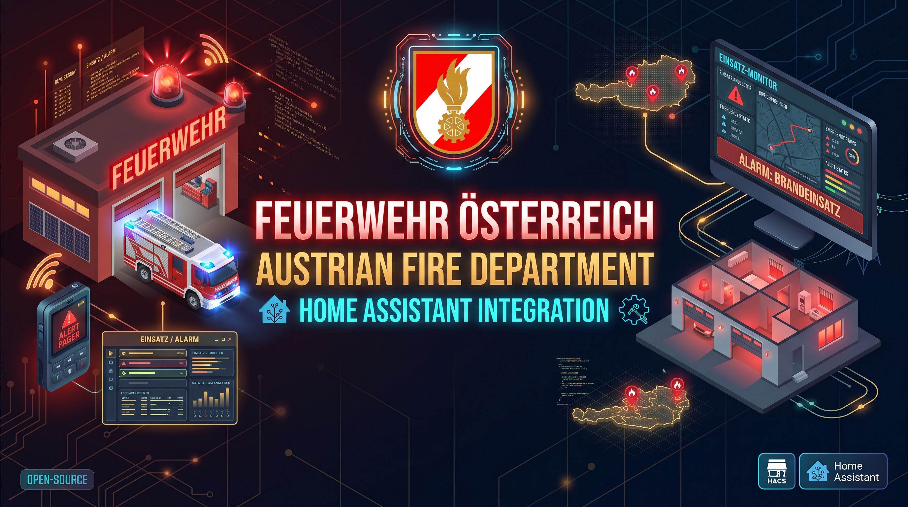

# Fire Department Austria

[](https://github.com/hacs/integration)
[](https://github.com/acdcnow/fire-department-for-Home-Assistant/releases)
[](https://www.home-assistant.io/)
[](LICENSE)

**Fire Department Austria** brings the public mission lists of the Austrian federal
states into Home Assistant. Running missions, deployed brigades and the mission history
of the last 24 hours become sensors, a binary sensor, map markers and automation events -
each mission carrying its town, district, alert keyword, category, severity and colour.

> **Unofficial project.** Not affiliated with, endorsed by or connected to any fire
> brigade, the ÖBFV or any federal fire brigade association. All data comes from
> publicly reachable pages - please read [Data sources and fair use](#data-sources-and-fair-use).

**Features** · [Supported regions](#supported-regions) · [Installation](#installation) ·
[Configuration](#configuration) · [Entities](#entities) · [Mission data](#mission-data) ·
[Dashboards](#dashboards) · [Map](#map) · [Automations](#automations) ·
[Troubleshooting](#troubleshooting) · [Development](#development) ·
[Documentation](#documentation)

---

## Features

| Feature | Description |
| --- | --- |
| **Live mission list** | Running missions with town, district, alert keyword, category, severity, colour and involved brigades |
| **Deployed brigades** | One row per fire brigade currently in action - the WASTL pages even give you the brigade number |
| **Mission history** | Finished missions of the last 24 hours, including the duration when the source knows it |
| **Binary sensor** | `Operations running` turns `on` while at least one mission is running |
| **Automation events** | `fire_department_new_incident` and `fire_department_incident_closed` |
| **Colour option** | Every row carries a `color` attribute - by severity, mission type, federal state or the colour used by the source |
| **Category filter** | Show only `fire`, `technical`, `hazardous`, `exercise` or `special` missions |
| **Map markers** | One `geo_location` entity per running mission, ready for the built-in map card |
| **Diagnostics** | Complete download from the device page for bug reports |
| **Options flow + reload** | Change interval, colours, filters or sources in the UI - the integration reloads itself |
| **One device per entry** | All sensors of a region are grouped into one Home Assistant device with working Documentation and Issue tracker links |

## Supported regions

| Federal state | Source | Running missions | Brigades in action | History |
| --- | --- | --- | --- | --- |
| **Lower Austria (NÖ)** | WASTL tables of the district alert centre (`feuerwehr-krems.at`) | ✅ | ✅ (with brigade number) | ✅ |
| **Upper Austria (OÖ)** | Mission list of the Oö. Landes-Feuerwehrverband (`einsaetze.ooelfv.at`) | ✅ | ✅ derived from the mission list | ✅ (last 24 h) |
| **Styria (ST)** | Mission list of the LFV Steiermark (`einsatzuebersicht.lfv.steiermark.at`, comma/semicolon CSV) | ✅ | ✅ derived from the mission list | ✅ (last 24 h) |

The remaining federal states do not publish a machine readable mission list yet:

| Federal state | Candidate page (not implemented) |
| --- | --- |
| Vienna | No public live list. `blaulicht-live.at` is a news page, not a mission list |
| Salzburg | `lfv-sbg.at/kategorie/einsatz/` (editorial news) |
| Carinthia | `einsatz.or.at` links to `feuerwehr.einsatz.or.at` (app/support page) |
| Burgenland | `lsz-b.at/fuer-einsatzorganisationen/feuerwehr-einsatzkarte/` (map only) |
| Tyrol | `feuerwehr.tirol/aktuelle-alarmierungen/` (WordPress news + RSS) |
| Vorarlberg | `lfv-vorarlberg.at` (association news) |

Any of these can be added as a **custom source** in the options as soon as it prints a
table - see [Custom sources](#custom-sources).

---

## Installation

### HACS (recommended)

1. Open **HACS → Integrations**.
2. Open the three-dot menu → **Custom repositories**.
3. Add `https://github.com/acdcnow/fire-department-for-Home-Assistant` with category **Integration**.
4. Search for **Fire Department Austria**, download it and restart Home Assistant.
5. **Settings → Devices & Services → Add integration → Fire Department Austria**.

### Manual

Copy `custom_components/fire_department` into your `config/custom_components/` folder,
restart Home Assistant and add the integration. There are no Python dependencies to install.

### Requirements

* Home Assistant **2026.9** or newer.
* One config entry per federal state - each state gets its own device.

---

## Configuration

| Field | Meaning |
| --- | --- |
| Name | Device name, e.g. `Fire Department Lower Austria` |
| Federal state | Lower Austria, Upper Austria or Styria (one entry per state) |
| Update interval | 5 - 720 minutes, default 30 |
| Colour scheme | `severity`, `category`, `source`, `source_color` or `none` |
| Mission types | Optional filter, e.g. only `fire` and `technical` |

### Options

**Configure** on the entry opens a menu. Every action saves immediately and reloads the
integration - no restart needed.

| Menu entry | What it does |
| --- | --- |
| **General settings** | Update interval, colour scheme, category filter, number of missions kept in the attributes, map markers |
| **Data sources** | Pick the page per sensor, or set a sensor to *Not used* to remove it |
| **Add custom source** | Read any supported table format from another address |
| **Remove custom source** | Delete custom sources again |

Reload manually at any time with **⋮ → Reload** on the entry, by changing the options, or
programmatically with `homeassistant.reload_config_entry`.

### Custom sources

Custom sources use the parsers of the built-in pages, so district pages of the WASTL
network or other lists in the same format can be added:

| Parser | Expected table |
| --- | --- |
| `wastl_incidents` | `[icon] | control centre | town | alert text | DD.MM.YYYY [HH:MM]` |
| `wastl_units` | `[icon] | brigade number + town | alert text | DD.MM.YYYY < 1 std.` |
| `ooe` | colour chip + `town (district): alert text` with one `<li>` per brigade |
| `stmk_csv` | `date;assigned_units;tycod;s_name;esz;dgroup;sub_tycod` |

---

## Entities

| Entity | Description |
| --- | --- |
| `sensor.<name>_active_operations` | Number of running missions |
| `sensor.<name>_deployed_fire_brigades` | Number of deployed brigades |
| `sensor.<name>_completed_missions` | Number of finished missions of the window |
| `binary_sensor.<name>_operations_running` | `on` while at least one mission is running (`device_class: safety`) |
| `geo_location.<name>_<alarm>_<town>` | One map marker per running mission (`source: fire_department`), created and removed with the mission |

### Attributes

```yaml
count: 12                       # same as the state
incidents: [...]                # list of mission dictionaries, newest first
truncated: false                # true when "Missions in the attributes" cuts the list
max_items: 25
latest_incident: {...}          # newest mission
by_category: {technical: 7, fire: 3, exercise: 2}
by_district: {LI: 3, HB: 2}
by_keyword: {T01: 5, B06: 2}
brigades: {Feuerwehr Mustorf: 2}
filter_categories: []           # active category filter
color_scheme: severity
color_legend: {high: '#dc2626', medium: '#f59e0b', low: '#2563eb', info: '#6b7280'}
source_id: noe_active
source_url: https://www.feuerwehr-krems.at/...
source_parser: wastl_incidents
source_kind: active_operations
source_region: lower_austria
source_window: live
fetched_at: 2026-09-19T15:31:02.114+00:00
last_error: null
average_duration_minutes: 31    # history sensors only
longest_running: {...}          # active sensors only
```

---

## Mission data

Every mission in `incidents` is a dictionary. Only keys with a value are present, which
keeps the attributes small.

| Key | Example | Meaning |
| --- | --- | --- |
| `id` | `03149cb42f8adcb1` | Stable id, used to detect new missions |
| `date` | `19.09.2026` | Date as published |
| `started` | `2026-09-19T15:22:00+02:00` | ISO timestamp (missing when the source only prints a relative age) |
| `ended` | `2026-09-19T15:34:00+02:00` | Only when the source knows it |
| `duration_minutes` | `24` | Comes from `started` / `ended` |
| `age` | `< 1 std.` | Relative age text of the WASTL pages |
| `station` | `Alarmzentrale` | Alerting control centre (NÖ only) |
| `municipality` | `Handenberg` | Town / municipality |
| `district` / `district_code` | `Braunau` / `BR` | District, when the source publishes it |
| `type` | `B1 Gefahrenmeldeanlage - Brand` | Alert text as published |
| `keyword` | `B1`, `T03V`, `SOF1` | Normalised alarm keyword |
| `level` | `1` | Numeric level, only for single digit keywords such as `B1` |
| `category` | `fire` | `fire`, `technical`, `hazardous`, `exercise`, `special`, `other` |
| `severity` | `medium` | `high`, `medium`, `low`, `info` |
| `color` | `#dc2626` | Colour for this row |
| `source_color` | `red` | Raw colour chip of the source (OÖ only) |
| `running` | `true` | `true` = mission running, `false` = finished |
| `unit_count` | `3` | Involved brigades |
| `units` | `[{name: Feuerwehr X, started: ..., ended: ...}]` | Involved brigades |
| `brigade` / `brigade_code` | `Mustorf` / `140302` | Set on deployed brigade rows |

---

## Dashboards

The `dashboard files` folder contains ready to paste cards:

| File | Content |
| --- | --- |
| [`pro/fire_department_pro.yaml`](dashboard%20files/pro/README.md) | **Recommended:** complete dashboard with KPI tiles, live map, group bars and tables for all three views - works without adjusting a single entity id |
| `active_operations.yaml` | Grid with running missions, brigade list and history, colour coded |
| `deployed_brigades.yaml` | Single card with all deployed brigades |
| `completed_missions.yaml` | Single card with the mission history |
| `operational_Overview.yaml` | iframe with the WASTL overview map (Lower Austria) |

Rows are colour coded through the `color` attribute:

```jinja

  <tr>
    <td style="background: {{ mission.color }}; color: #fff; padding: 2px 6px">{{ mission.keyword }}</td>
    <td>{{ mission.time or mission.age }}</td>
    <td>{{ mission.municipality }} ({{ mission.district }})</td>
    <td>{{ mission.type }}</td>
  </tr>

```

A category legend can be rendered from `color_legend`.

---

## Map

Every running mission becomes a `geo_location` entity, so the built-in map card shows the
current situation without any additional integration:

```yaml
type: map
geo_location_sources:
  - source: fire_department
    label_mode: name      # name | state | attribute | icon
auto_fit: true
```

* The marker sits in the **centre of the municipality** - the mission lists publish no
  coordinates, so the town is looked up once (see below) and its position cached.
* Name: `<keyword> · <town>`, state: **distance from home in metres**, attributes: the whole
  mission, so automations can react to a marker.
* Markers are created and removed with the missions.
* The tiles behind the map are served by the **`map_tiles` system integration** of Home
  Assistant 2026.9, which proxies the OpenStreetMap tiles through your own instance behind a
  rotating token (32 MB in-memory cache, no API key, nothing loaded from a third party by
  your browser).
* No markers wanted? Switch them off in **Configure → General settings → Map markers**.
  WASTL's own overview map and a plain OpenStreetMap embed are part of the
  [pro dashboard](dashboard%20files/pro/README.md).

### Geocoding and privacy

Municipalities that are not cached yet are looked up at `nominatim.openstreetmap.org`
(OpenStreetMap). The requests are throttled to one per second and cached permanently in
`.storage/fire_department_geocoding`, including negative results, so after the first few
days an installation is effectively offline. With *Map markers* switched off no request is
made at all.

---

## Automations

New and finished missions are published on the event bus:

```yaml
automation:
  - alias: New fire mission
    triggers:
      - trigger: event
        event_type: fire_department_new_incident
    actions:
      - action: notify.persistent_notification
        data:
          title: "{{ trigger.event.data.incident.keyword }} in {{ trigger.event.data.incident.municipality }}"
          message: "{{ trigger.event.data.incident.type }}"
```

The payload contains `entry_id`, `source`, `region` and the full `incident` dictionary.
Events are fired for *running mission* sources only, and the first refresh after a restart
does not fire anything.

```yaml
  - alias: Fire brigade on the way
    triggers:
      - trigger: state
        entity_id: binary_sensor.fire_department_operations_running
        from: "off"
        to: "on"
```

---

## Data design

* **One coordinator per config entry.** Sources that share a URL (all three Styrian sensors)
  are downloaded **once** per refresh, then parsed per sensor.
* **Sources are declarative** (`const.py`): URL, parser, sensor kind, time window, row filter
  and optional unit expansion. Adding a state means adding a dictionary.
* **Parsing is pure Python** (`provider.py`, no Home Assistant imports), so it can be tested
  with a plain interpreter. A small forgiving HTML table parser handles the hand written
  ASP/PHP tables (unclosed `<li>`, unquoted attributes).
* **Encodings are detected** per response: the WASTL pages are `windows-1252` without a
  charset header, OÖ is UTF-8 (with declared charset), the Styrian feed is UTF-8 with a BOM.
* **Partial failures do not kill the entry.** If one page is down, only its sensor becomes
  `unavailable`; the others keep working. The entry only becomes unavailable when *no* source
  could be read.
* **Attributes are capped.** Home Assistant drops state attributes above 16 KiB, so the row
  list is limited by the *Missions in the attributes* option (default 25, `0` = counts only).
  The state itself always reports the full count.
* **Stable ids** (`sha1` over source + timestamp + place + alert text) make new / finished
  mission detection reliable across refreshes and restarts.

---

## Data sources and fair use

* Lower Austria: `feuerwehr-krems.at` (WASTL). `robots.txt` only disallows the internal
  infoscreen (`eldisdata.asp`) - the mission pages used here are allowed.
* Upper Austria: `einsaetze.ooelfv.at` (LFV OÖ).
* Styria: `einsatzuebersicht.lfv.steiermark.at` (LFV Steiermark, public app feed).

The integration polls at most once per update interval (minimum 5 minutes) and sends a
descriptive `User-Agent` including a link to this repository. Please keep the interval
reasonable - these are volunteer run servers.

---

## Troubleshooting

| Symptom | Reason / fix |
| --- | --- |
| A sensor shows `unavailable` | That single page could not be read - the `last_error` attribute of the sensor and the diagnostics tell you which URL failed |
| Counts are 0 | No missions in the current window - that is a valid result, the sensor stays `0` |
| `incidents` is empty but the count is high | *Missions in the attributes* is 0 or lower than the count, raise it in the options |
| History has no timestamps | Some sources only publish a date and no time (`date_only: true`) |
| Missions are missing | Check the category filter in the options |

### Upgrading from 2.x

* **Breaking:** `data_list` (a list of lists with implicit columns) was replaced by
  `incidents` (a list of mission dictionaries) - see [Mission data](#mission-data). The
  shipped dashboards are updated.
* **Home Assistant 2026.9 or newer** is required (`ConfigFlowResult`, `entry.runtime_data`,
  `DeviceInfo` from `homeassistant.helpers.device_registry`).
* Existing config entries are migrated automatically on first start: the old page list is
  converted into source ids and unknown pages stay as custom sources.
* Sensors are grouped into one device per entry, so entity ids may change.

The full history - including the defects that 3.0.0 fixed (a wrong repository link, nine
federal states without URLs, dropped brigade numbers, an unclosed `aiohttp` session,
untranslated options steps, duplicate entries) - is in the [CHANGELOG](CHANGELOG.md).

---

## Development

```bash
python tests/test_integration.py
```

The suite runs without Home Assistant: `tests/ha_stub.py` stubs the small part of the Home
Assistant API the integration touches, and `tests/fixtures/` holds small documents in the
format of every supported page. The 26 test functions cover the parsers and helpers, the
entry lifecycle, entities and attributes, events, partial and total failures, the config and
options flows and the migration.

> Run the suite through `python tests/test_integration.py`, not `pytest`: it keeps its own
> failure counter and only exits non-zero through its `main()`.

`tests/ha_stub.py` is deliberately small - it implements just the API surface listed above,
so a new Home Assistant call usually needs a matching stub.

---

## Documentation

Design and developer documentation lives in the **[project wiki](https://github.com/acdcnow/fire-department-for-Home-Assistant/wiki)**:

| Document | Contents |
| :--- | :--- |
| 🏛️ [Architecture Design Document](https://github.com/acdcnow/fire-department-for-Home-Assistant/wiki/Architecture-Design-Document) | Scope, requirements, context, component decomposition, architectural decisions, cross-cutting concerns, risks |
| 🛠️ [Software Design Document](https://github.com/acdcnow/fire-department-for-Home-Assistant/wiki/Software-Design-Document) | Module inventory, interface contracts, mission dictionary, component design, dynamic behaviour, error matrix, test and release process |
| 📈 [Workflow Diagrams](https://github.com/acdcnow/fire-department-for-Home-Assistant/wiki/Workflow-Diagrams) | Repository map plus setup, update, parsing, event, reload and migration workflows |
| ➕ [Adding a New Source](https://github.com/acdcnow/fire-department-for-Home-Assistant/wiki/Adding-a-New-Source) | How to add a federal state or a new page format |
| 🗄️ [Design Documentation 2.2.0](https://github.com/acdcnow/fire-department-for-Home-Assistant/wiki/Archive-2.2.0-Design-Documentation) | Archived documentation of the old 2.x line, including its known defects |

## License

GPL-3.0 - see [LICENSE](LICENSE).
